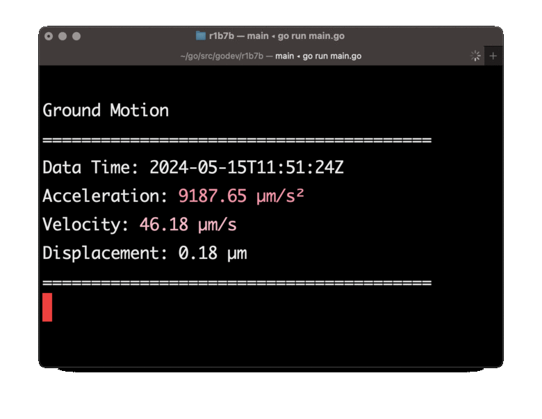

# Ground Motion Monitoring System



This project provides a real-time monitoring system for ground motion using data from a Raspberry Shake sensor. It fetches ground motion data and displays the information in the console, with color-coded output for different levels of acceleration and velocity. The system also plays sounds based on the severity of the ground motion detected.

## Features

- Fetches real-time ground motion data from a specified URL.
- Displays acceleration, velocity, and displacement data.
- Color-coded output to indicate different levels of ground motion.
- Plays sounds to alert users of significant ground motion.
- Configurable via environment variables.

## Prerequisites

- Go (Golang) version 1.22 or higher
- Raspberry Shake sensor
- Internet connection

## Installation

1. Clone the repository:

```bash
git clone https://github.com/Rishats/rsreader.git
cd rsreader
```

2. Install the required Go packages:

```bash
go get -u github.com/fatih/color
go get -u github.com/joho/godotenv
```

## Configuration

### Environment Variables

The system is configured using environment variables. You can create a `.env` file in the root directory of the project to set these variables.

### .env Example

Create a `.env` file with the following content:

```
URL=https://api.raspberryshake.org/query/objects.json
LOG_FILE=sensor.log
SENSOR_ID=AM.R1B7B
SOUND_HIGH_THRESHOLD=3500.0
SOUND_MEDIUM_THRESHOLD=350.0
```

- `URL`: The URL to fetch data from. The default is `https://api.raspberryshake.org/query/objects.json`.
- `LOG_FILE`: The file to log errors to. The default is `sensor.log`.
- `SENSOR_ID`: The ID of the sensor to monitor. The default is `AM.R1B7B`, which is located in Tokmok, Kyrgyzstan.
- `SOUND_HIGH_THRESHOLD`: The acceleration threshold for playing a high-level sound. The default is `3500.0`.
- `SOUND_MEDIUM_THRESHOLD`: The acceleration threshold for playing a medium-level sound. The default is `350.0`.

### Running the Program

1. Ensure you have created and configured your `.env` file as described above.
2. Run the program:

```bash
go run main.go
```

## Usage

1. When you start the program, you will see an introduction and a legend explaining the parameters and color codes.
2. Press space and Enter to start fetching and displaying data.
3. The program will continuously fetch data and update the display every second.
4. Sounds will be played based on the acceleration values.

## Notes

- The program logs errors to a file specified in the `LOG_FILE` environment variable.
- Ensure your sensor ID is correct and matches the one provided in the `.env` file.
- The default sensor ID `AM.R1B7B` is for a sensor located in Tokmok, Kyrgyzstan.

## Legend

### Ground Motion Legend

| Parameter     | Description                              | Units                 | Desired Range   |
|---------------|------------------------------------------|-----------------------|-----------------|
| Acceleration  | Peak ground acceleration in last 10s     | micrometers/sec²      | Noise level < 0.5 |
| Velocity      | Peak ground velocity in last 10s         | micrometers/sec       | Noise level < 0.1 |
| Displacement  | Peak ground displacement in last 10s     | micrometers           | Noise level ~0  |

### Velocity Color Legend

- Blue: 0.0 - 0.2 µm/s
- Cyan: 0.2 - 0.4 µm/s
- HiGreen: 0.4 - 0.8 µm/s
- HiYellow: 0.8 - 1.5 µm/s
- Yellow: 1.5 - 4.0 µm/s
- HiMagenta: 4.0 - 12.0 µm/s
- Magenta: 12.0 - 30.0 µm/s
- HiRed: 30.0 - 60.0 µm/s
- Red: 60.0 - 1000.0 µm/s

### Acceleration Color Legend

- Green: 0 - 350 µm/s²
- Yellow: 350 - 3500 µm/s²
- Red: 3500 - 10000 µm/s²

## Troubleshooting

- Ensure your `.env` file is correctly configured.
- Check the log file specified in the `LOG_FILE` environment variable for any errors.
- Verify that the sensor ID is correct and the sensor is active.

## Contributing

Contributions are welcome! Please fork the repository and submit a pull request.

## License

This project is licensed under the MIT License. See the LICENSE file for details.